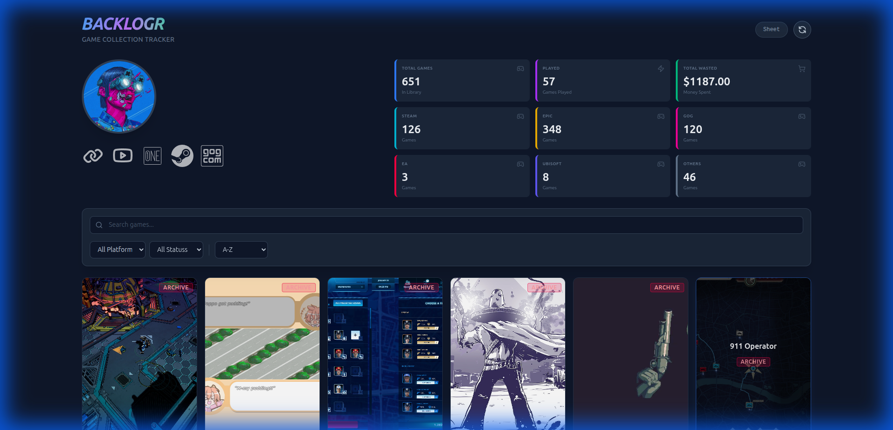

# 🎮 Backlogr

A modern, beautiful game library tracker that syncs with your Google Sheets to manage and showcase your game collection. Built with React, Vite, and Tailwind CSS.



## ✨ Features

- 📊 **Google Sheets Integration** - Automatically syncs your game library from a Google Sheet with direct link access
- 🎨 **Beautiful UI** - Modern, responsive design with smooth animations and mobile optimization
- 🔍 **Advanced Filtering** - Search, filter by platform, status, and sort by name or price
- 📈 **Statistics Dashboard** - Track total games, played count (Completed + Played), money spent, and platform breakdown
- 🖼️ **Game Covers** - Automatically fetches game cover images from RAWG API
- 📄 **Pagination** - Clean pagination for large game libraries (24 games per page)
- 💰 **Budget Tracking** - Calculates total money spent on games from "Games Bought" and "Prime Gaming" sections
- 🔄 **Manual Reload** - Refresh data from Google Sheets with a single click
- 🎯 **Color-Coded Status Badges** - Visual status indicators (Completed: Purple, Playing: Green, Played: Blue, Backlog: Yellow, Archive: Red)
- ❓ **Built-in Help** - Quick access to usage guide and manual

## 🚀 Getting Started

### Prerequisites

- Node.js (v18 or higher)
- npm or yarn
- A Google Sheet with your game library
- RAWG API key (free)

### Installation

1. **Clone the repository**
   ```bash
   git clone <your-repo-url>
   cd Backlogr
   ```

2. **Install dependencies**
   ```bash
   npm install
   ```

3. **Set up environment variables**
   
   Create a `.env` file in the root directory:
   ```bash
   cp .env.example .env
   ```
   
   Edit `.env` and add your RAWG API key:
   ```
   VITE_RAWG_API_KEY=your_api_key_here
   ```
   
   > **Get a free RAWG API key:** Visit [https://rawg.io/apidocs](https://rawg.io/apidocs) and sign up for a free account.

4. **Configure your Google Sheet**
   
   Update the `SHEET_URL` in `src/services/sheetService.js` with your Google Sheet export URL:
   ```javascript
   const SHEET_URL = 'https://docs.google.com/spreadsheets/d/YOUR_SHEET_ID/export?format=csv';
   ```
   
   > **Important:** Make sure your Google Sheet is published to the web (File → Share → Publish to web → CSV format)

5. **Run the development server**
   ```bash
   npm run dev
   ```
   
   Open [http://localhost:5173](http://localhost:5173) in your browser.

## 📋 Google Sheet Format

Your Google Sheet should have the following structure:

### Main Library (Columns A-C)
| Name | Platform | Status |
|------|----------|--------|
| Game Title | Steam/Epic/GOG/etc | Completed/Playing/Played/Backlog/Archive |

### Games Bought (Columns E-G)
| Name | Platform | Price |
|------|----------|-------|
| Game Title | Steam | 50 |

### Prime Gaming (Columns I-K)
| Name | Platform | Price |
|------|----------|-------|
| Game Title | GOG | 120 |

> **Note:** The first row should contain headers: `Name`, `Platform`, `Status` for the main list.

## 🛠️ Tech Stack

- **React 19** - UI framework
- **Vite** - Build tool and dev server
- **Tailwind CSS** - Utility-first CSS framework
- **Framer Motion** - Animation library
- **PapaParse** - CSV parsing
- **Lucide React** - Icon library
- **RAWG API** - Game cover images and metadata

## 📁 Project Structure

```
Backlogr/
├── public/
│   └── profile.jpg          # Profile picture
├── src/
│   ├── components/
│   │   ├── FilterBar.jsx    # Search and filter controls
│   │   ├── GameCard.jsx     # Individual game card
│   │   ├── GameGrid.jsx     # Game grid layout
│   │   ├── Pagination.jsx   # Pagination controls
│   │   ├── ProfileStats.jsx # User stats dashboard
│   │   └── StatsDashboard.jsx # (Legacy stats component)
│   ├── hooks/
│   │   └── useLibraryData.js # Google Sheets data fetching hook
│   ├── services/
│   │   ├── rawgService.js   # RAWG API integration
│   │   └── sheetService.js  # Google Sheets CSV parsing
│   ├── App.jsx              # Main application component
│   ├── index.css            # Global styles
│   └── main.jsx             # Application entry point
├── .env.example             # Environment variables template
├── .gitignore               # Git ignore rules
├── package.json             # Dependencies and scripts
└── vite.config.js           # Vite configuration
```

## 🔒 Security

### Protecting Your API Keys

1. **Never commit `.env` files** - The `.env` file is already in `.gitignore`
2. **Use `.env.example`** - Share this template file instead of your actual `.env`
3. **Rotate exposed keys** - If you accidentally commit your API key, regenerate it immediately at [RAWG API Settings](https://rawg.io/apidocs)

### If You Already Committed `.env`

If your `.env` file was previously committed to Git:

```bash
# Remove from Git tracking (keeps local file)
git rm --cached .env

# Commit the change
git add .gitignore
git commit -m "chore: remove .env from version control"

# Regenerate your API key at https://rawg.io/apidocs
# Update your local .env file with the new key
```

## 🎯 Usage

### Adding Games
Add games to your Google Sheet in the main library section (columns A-C). The app will automatically fetch them on reload.

### Tracking Purchases
Add purchased games to the "Games Bought" section (columns E-G) with their prices. The app will calculate your total spending.

### Filtering Games
- **Search**: Type game names in the search bar
- **Platform**: Filter by Steam, Epic, GOG, etc.
- **Status**: Filter by Completed, Playing, Played, Backlog, or Archive
- **Sort**: Sort by name or price (high/low)

### Status Badge Colors
- 🟣 **Completed** - Games you've finished
- 🟢 **Playing** - Currently playing
- 🔵 **Played** - Games you've played
- 🟡 **Backlog** - Games waiting to be played
- 🔴 **Archive** - Archived games

### Refreshing Data
Click the reload button (🔄) in the top-right corner to fetch the latest data from your Google Sheet.

### Accessing Your Sheet
Click the "Sheet" link in the top-right corner to open your Google Sheet directly in a new tab.

### Getting Help
Click the help button (❓) next to the reload button for quick usage instructions and tips.

## 🏗️ Building for Production

```bash
npm run build
```

The built files will be in the `dist/` directory, ready to deploy to any static hosting service (Vercel, Netlify, GitHub Pages, etc.).

## 📝 License

This project is open source and available under the MIT License.

## 🤝 Contributing

Contributions, issues, and feature requests are welcome!

## 👤 Author

Built with ❤️ by [Your Name]

---

**Enjoy tracking your game backlog!** 🎮✨
